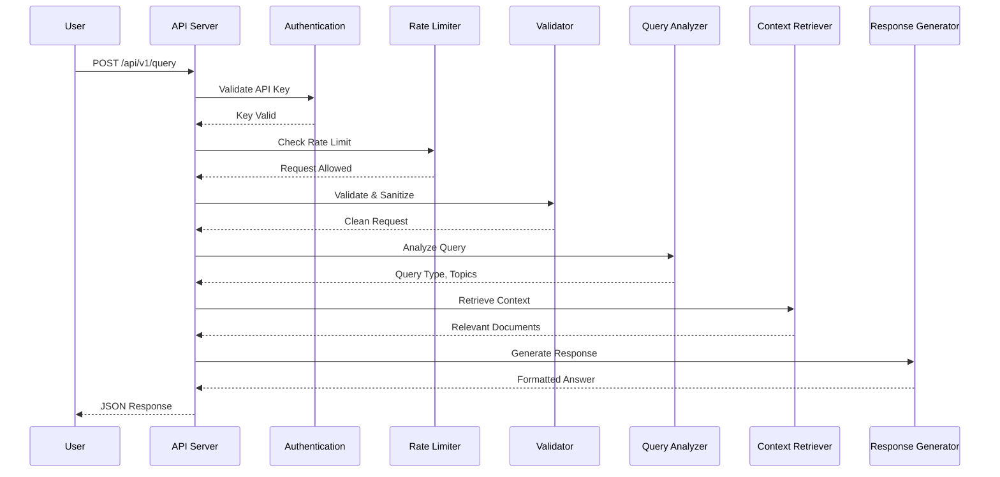
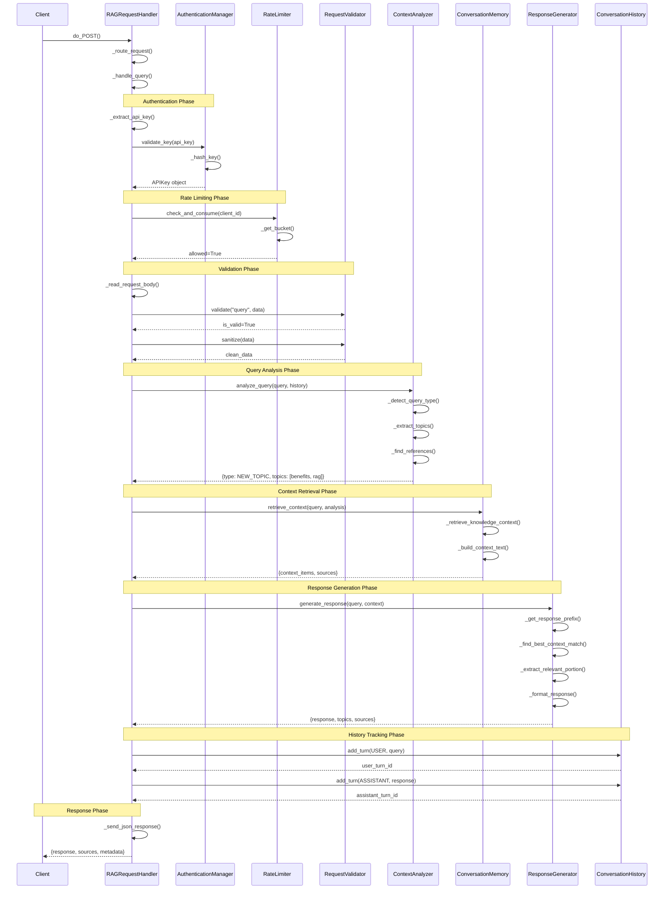
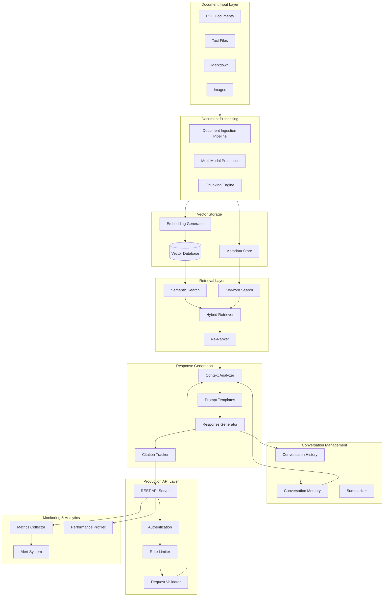

# Master RAG Implementation with Anthropic Claude

## Building a Production-Ready RAG System with GROOT

---

## Overview

This project demonstrates a comprehensive **Retrieval-Augmented Generation (RAG)** system built using **GROOT** (Guided Resource for Organized Objective Training) - a phased, educational approach to developing production-grade AI applications with Anthropic Claude.

The system was developed across **5 progressive phases**, each building upon the previous to create a fully functional, production-ready RAG application.

---

## Phased Development Approach

### Development Philosophy

Rather than building everything at once, GROOT guided us through an incremental approach where each phase:
- Introduced new concepts and capabilities
- Built on foundations from previous phases
- Included comprehensive testing and validation
- Resulted in working, demonstrable functionality

### Phase Summary

| Phase | Focus | Key Components |
|-------|-------|----------------|
| **Phase 1** | RAG Foundations | Document ingestion pipeline, basic Q&A system |
| **Phase 2** | Semantic Search | Vector database, embeddings, evaluation framework |
| **Phase 3** | Advanced RAG | Prompt templates, citations, context-aware system |
| **Phase 4** | Multi-Modal & Conversational | Hybrid retrieval, conversation memory, Web UI |
| **Phase 5** | Production Deployment | REST API, authentication, rate limiting, monitoring |

---

## Phase 1: RAG Foundations & Document Processing

**Goal:** Establish core document processing and basic retrieval capabilities

### Components Built

- **Document Ingestion Pipeline** (`document_ingestion_pipeline.py`)
  - Multi-format support (PDF, TXT, MD)
  - Intelligent text chunking with configurable overlap
  - Metadata extraction (source, page number, chunk position)
  - Sentence-boundary preservation for semantic coherence

- **Basic RAG Q&A System** (`basic_rag_question_answering_system.py`)
  - Keyword-based text similarity search
  - Context formatting for Claude API
  - Source citation and attribution

### Key Learnings
- RAG solves LLM knowledge limitations by grounding responses in retrieved documents
- Chunking strategy significantly impacts retrieval quality
- Metadata preservation enables accurate source attribution

---

## Phase 2: Semantic Search with Embeddings

**Goal:** Upgrade from keyword matching to semantic understanding

### Components Built

- **Vector Database** (`vector_database_implementation.py`)
  - In-memory vector store with cosine similarity search
  - Sub-100ms query response for 10K embeddings
  - Batch insertion and metadata filtering

- **Semantic RAG System** (`semantic_rag_system.py`)
  - Embedding-based similarity scoring
  - Improved relevance over keyword approaches

- **Retrieval Evaluation Framework** (`retrieval_evaluation_framework.py`)
  - Precision@k, Recall@k, MRR metrics
  - Comparative analysis capabilities

### Key Learnings
- Embeddings capture semantic meaning beyond exact word matches
- Evaluation frameworks are essential for measuring and improving retrieval quality
- Vector database performance is critical for real-time applications

---

## Phase 3: Advanced RAG with Prompts & Citations

**Goal:** Improve answer quality through prompt engineering and source tracking

### Components Built

- **Prompt Template Library** (`rag_prompt_template_library.py`)
  - Templates for factual Q&A, summarization, comparison, analysis
  - Domain-specific variants (technical, legal, academic)
  - Confidence-based fallback prompts

- **Context-Aware RAG System** (`context_aware_rag_system.py`)
  - Retrieval confidence analysis
  - Query classification for prompt selection

- **Citation Tracking System** (`citation_and_source_tracking_system.py`)
  - Source-to-text mapping
  - Multiple citation formats
  - Hallucination reduction through explicit attribution

### Key Learnings
- Prompt engineering dramatically affects response quality
- Citations build trust and enable verification
- Context quality signals enable adaptive behavior

---

## Phase 4: Multi-Modal RAG & Conversational Interface

**Goal:** Handle diverse content types and enable natural conversations

### Components Built

- **Multi-Modal Processor** (`multi_modal_document_processor.py`)
  - Image processing with OCR capabilities
  - Table extraction and structured data handling
  - Unified output format across content types

- **Hybrid Retrieval System** (`hybrid_retrieval_system.py`)
  - Combines semantic, keyword, and metadata approaches
  - Query expansion and re-ranking

- **Conversational Interface** (`conversational_rag_interface.py`)
  - Conversation history and memory
  - Follow-up question handling
  - Context-aware responses

- **Web UI** (`web_ui.py`)
  - Flask-based interactive interface
  - Real-time chat experience

### Key Learnings
- Multi-modal content requires specialized processing pipelines
- Hybrid retrieval outperforms single-strategy approaches
- Conversation context enables natural, coherent dialogues

---

## Phase 5: Production RAG Deployment

**Goal:** Transform into a production-ready, enterprise-grade application

### Components Built

- **Production API** (`production_rag_api.py`)
  - REST API with OpenAPI documentation
  - API key authentication (SHA-256)
  - Token bucket rate limiting
  - RFC 7807 error handling

- **Monitoring Dashboard** (`monitoring_and_analytics_dashboard.py`)
  - Real-time metrics tracking
  - Alert system for failures
  - A/B testing framework

- **Performance Optimization** (`performance_optimization_suite.py`)
  - LRU caching for queries and embeddings
  - Cost monitoring and budget alerts
  - Performance profiling

### Key Learnings
- Production systems require authentication, rate limiting, and monitoring
- Caching dramatically improves performance and reduces costs
- Comprehensive logging enables debugging and optimization

---

## RAG Elements Demonstrated

This project covers the full spectrum of RAG capabilities:

| Category | Elements |
|----------|----------|
| **Document Processing** | Ingestion, chunking, metadata extraction |
| **Retrieval** | Vector search, hybrid strategies, re-ranking |
| **Generation** | Prompt templates, context formatting, citations |
| **Conversation** | History tracking, follow-up handling, memory |
| **Production** | API design, auth, rate limiting, monitoring |

---

## Query Flow: High-Level Overview

The following diagram shows how a query like **"What are the benefits of RAG?"** flows through the system:



---

## Query Flow: Detailed Method-Level Sequence

For the query **"What are the benefits of RAG?"**, here is the exact method-by-method flow:



---

## System Architecture



---

## Caveats & Future Enhancements

### What This Demo Is

This project is an **educational demonstration** of RAG architecture patterns and component design. It successfully illustrates:

- How RAG components connect and interact
- The flow from query to response
- Production concerns (auth, rate limiting, monitoring)
- Conversational context management
- Phased, incremental development methodology

### Simplifications vs. Production Systems

| Component | This Demo | Production Implementation |
|-----------|-----------|---------------------------|
| **Vector Database** | In-memory Python dict | Pinecone, Weaviate, Qdrant, Milvus, pgvector |
| **Embeddings** | Word overlap / keyword matching | OpenAI ada-002, sentence-transformers, Cohere embed |
| **Knowledge Base** | 9 pre-loaded text snippets | 10K-1M+ documents from real file corpus |
| **Document Ingestion** | Simulated content | Real PDF/DOCX parsing, OCR, table extraction |
| **Chunking** | Pre-chunked items | Semantic chunking, token-aware splitting, overlap strategies |
| **Response Generation** | Extracts text from knowledge base | LLM API calls (Claude, GPT-4) with retrieved context |
| **Similarity Search** | `word_overlap * 0.15` scoring | Cosine similarity on 1536-dim vectors |
| **Persistence** | In-memory (lost on restart) | PostgreSQL, Redis, cloud storage |
| **Scale** | Single process, ~100 items | Distributed, millions of vectors, sub-100ms p99 |

### What a Full Production System Would Add

```
┌─────────────────────────────────────────────────────────────────┐
│                    PRODUCTION ENHANCEMENTS                       │
├─────────────────────────────────────────────────────────────────┤
│                                                                  │
│  Document Pipeline:                                              │
│  ├── Real file ingestion (PDF, DOCX, HTML, Confluence, etc.)    │
│  ├── Unstructured.io or LlamaIndex for parsing                  │
│  ├── Semantic chunking with sentence-transformers               │
│  └── Metadata extraction and enrichment                         │
│                                                                  │
│  Embedding Layer:                                                │
│  ├── OpenAI text-embedding-ada-002 or text-embedding-3-large    │
│  ├── Batch embedding pipeline                                   │
│  └── Embedding cache (Redis)                                    │
│                                                                  │
│  Vector Database:                                                │
│  ├── Pinecone / Weaviate / Qdrant / Milvus                      │
│  ├── Metadata filtering                                         │
│  ├── Hybrid search (dense + sparse vectors)                     │
│  └── HNSW or IVF indexing for scale                             │
│                                                                  │
│  Retrieval:                                                      │
│  ├── Query expansion / HyDE                                     │
│  ├── Re-ranking with cross-encoders (ms-marco, Cohere rerank)   │
│  ├── MMR for diversity                                          │
│  └── Contextual compression                                     │
│                                                                  │
│  Generation:                                                     │
│  ├── Claude API / OpenAI API calls                              │
│  ├── Streaming responses                                        │
│  ├── Prompt optimization                                        │
│  └── Guardrails and safety filters                              │
│                                                                  │
│  Infrastructure:                                                 │
│  ├── Kubernetes deployment                                      │
│  ├── Redis caching layer                                        │
│  ├── Async processing with Celery/RQ                            │
│  └── Observability (Datadog, OpenTelemetry)                     │
│                                                                  │
└─────────────────────────────────────────────────────────────────┘
```

### The Value of This Demo

Despite simplifications, this project demonstrates **correct architectural thinking**:

1. **Separation of Concerns** - Each component has a single responsibility
2. **Extensibility** - Swap in real implementations without changing the flow
3. **Production Patterns** - Auth, rate limiting, validation, monitoring are real
4. **Testability** - Components can be unit tested independently
5. **Educational Clarity** - Easy to understand without cloud dependencies

### Recommended Next Steps for Production

1. **Integrate Real Embeddings** - Add OpenAI or sentence-transformers
2. **Add Vector Database** - Start with Chroma (local) → Pinecone (cloud)
3. **Real Document Ingestion** - Use LlamaIndex or Unstructured.io
4. **LLM Generation** - Add Claude/GPT API calls for response synthesis
5. **Persistent Storage** - PostgreSQL for metadata, Redis for cache
6. **Deploy** - Containerize and deploy to cloud infrastructure

---

## Key Takeaways

1. **Phased Development Works** - Building incrementally with GROOT allowed for focused learning and solid foundations at each step

2. **RAG is More Than Retrieval** - A production RAG system requires document processing, vector storage, retrieval, generation, conversation management, and API infrastructure

3. **Quality Compounds** - Each phase's improvements (better chunking, semantic search, prompt engineering) compound to dramatically improve final output quality

4. **Production Readiness Matters** - Authentication, rate limiting, monitoring, and error handling are essential for real-world deployment

5. **Architecture Over Implementation** - This demo prioritizes teaching correct patterns; swapping in production components (real vector DB, embeddings, LLM calls) follows naturally from the established architecture

---

## Project Structure

```
groot-scott-demo/
├── src/
│   ├── document_ingestion_pipeline.py      # Phase 1
│   ├── basic_rag_question_answering_system.py
│   ├── vector_database_implementation.py   # Phase 2
│   ├── semantic_rag_system.py
│   ├── retrieval_evaluation_framework.py
│   ├── rag_prompt_template_library.py      # Phase 3
│   ├── context_aware_rag_system.py
│   ├── citation_and_source_tracking_system.py
│   ├── multi_modal_document_processor.py   # Phase 4
│   ├── hybrid_retrieval_system.py
│   ├── conversational_rag_interface.py
│   ├── production_rag_api.py               # Phase 5
│   ├── monitoring_and_analytics_dashboard.py
│   └── performance_optimization_suite.py
├── web_ui.py                               # Phase 4
├── tests/                                  # Comprehensive test suites
└── docs/
    └── RAG_Project_Presentation.md         # This file
```

---

## Questions?

This presentation demonstrates a complete journey from RAG fundamentals to production deployment, guided by GROOT's structured educational approach.
